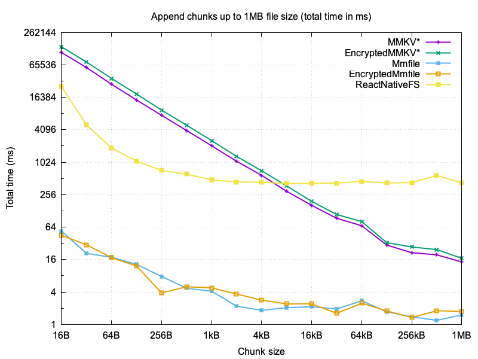

<div align="center">
  <h1 align="center">react-native-mmfile</h1>
  <h3 align="center">Fastest storage with encryption for React Native.</h3>
</div>

<div align="center">
  <a align="center" href="https://github.com/weese?tab=followers">
    
  </a>
  <br/>
</div>
<br/>

## Features

- 🚀 **High Performance:** Leverages mmap for memory-mapped file I/O, significantly outperforming [react-native-fs](https://github.com/itinance/react-native-fs).
Built on the new React Native architecture with [NitroModules](https://nitro.margelo.com), it enables zero-copy operations and direct ArrayBuffer access.
- 🛠️ **Simple API:** Easily `read`, `write`, or `append` files using the `Mmfile` or `EncryptedMmfile` objects.
- 🔒 **Encryption:** Supports AES-128 in CTR mode for real-time encryption/decryption and random access. The cipher is implemented in C++ and optimized for performance using NEON (ARM) and AES-NI (Intel) instructions.
- 📦 **Zero Dependencies:** No external libraries required—pure, efficient native code.
- 📱 **Cross-Platform:** Seamlessly works on both iOS and Android

## Performance

To compare the performance of **react-native-mmfile** to the most popular React Native storage modules [react-native-mmkv](https://github.com/mrousavy/react-native-mmkv) and [react-native-fs](https://github.com/itinance/react-native-fs), the following benchmark measures the total time it takes to write a file of 1GB by appending chunks of varying sizes (16 bytes to 1MB).

*) It's important to note that MMKV is not a file-based storage solution, but rather a key-value store and doesn't offer an append operation, so it had to overwrite the file each time, but even in a single write operation, it was still slower than **react-native-mmfile**.

<h3>
  <a href="#"></a>
</h3>

## Installation

<h3>
  React Native  <a href="#"></a>
</h3>

```sh
bun add react-native-mmfile react-native-nitro-modules
cd ios && pod install
```

## Usage

```ts
import { openMmfile, openEncryptedMmfile } from 'react-native-mmfile';

// encode 'Hello World' to ArrayBuffer using UTF-8 encoding
let data = new TextEncoder().encode('Hello World').buffer;

let mmapFile = openMmfile('hello.txt');
mmapFile.append(data);
mmapFile.close();
```

## API Reference

The full API reference is available [here](docs/API.md).

## Example App

The example app demonstrates the usage of `react-native-mmfile` and can be found in the `example` directory. To run the example app, follow these steps:

```bash
cd example
npm install

# For Android
npm run android 

# For iOS
cd ios
pod install
npm run ios     
```

## Run Tests

To run the tests, you need to install GoogleTests first, e.g. with Homebrew:

```bash
brew install googletest
```

And then use the following commands:

```bash
cd cpp/tests
mkdir build
cd build
cmake ..
cmake --build .
./mmfile_tests
ctest
```

## License

MIT
